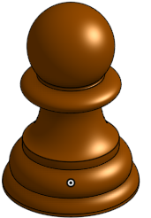
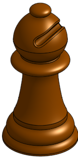
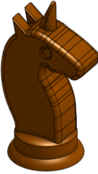
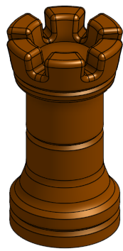
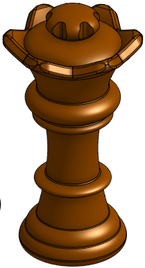
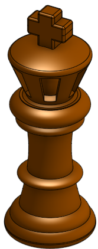
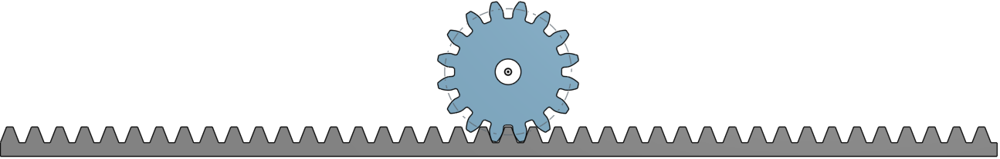
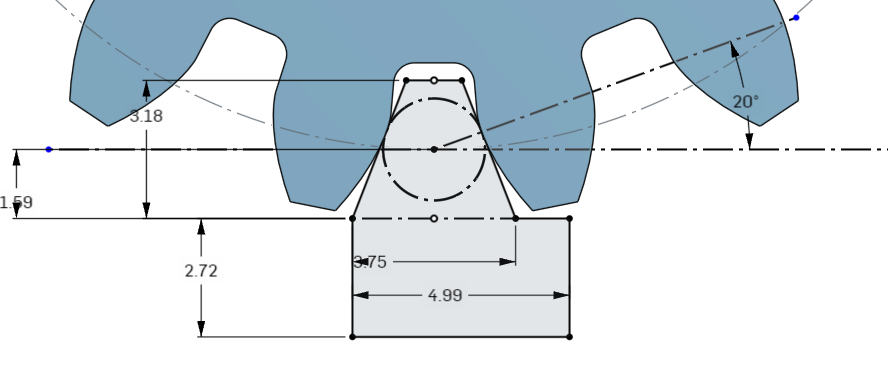
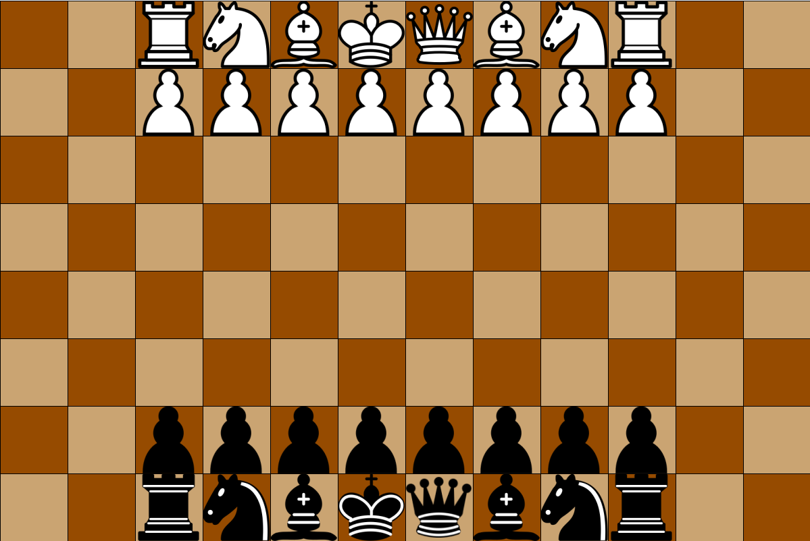

# Chess Robot Arm
### Table of Contents

* [Requirements](#Requirements)
* [CAD Section](#CAD-Section)
* [Chess Pieces](#Chess-Pieces)
* [Robot Arm & Box](#Robot-Arm-&-Box)
* [Rack & Pinion](#Rack-&-Pinion)
* [Coding Section](#Coding-Section)

## Requirements

This project has a very simple list of requirements including:

- Arduino Uno(or similar device)
- 3D Printer
- Laser Cutter
- 32 Small Neodymium Magnets
- Adhesive Felt Sheet
- Spray Paint
- Solenoid
- 3-4 Stepper motors
- Nuts and Bolts
- Images in Coding Requirements which is under Coding Pictures.

## Cad Section

### Chess Pieces

In this project, I didn't want to just brush by the designing aspect and rip some chess piece designs off the internet. I wanted to actually try to design my own. Not only would it make it more legit, but it would be fun and give me good practice with Onshape. So that is exactly what I did. Using the revolve tool, I could create a 2d sketch of a chess piece cut in half. All I would have to do is revolve it around the center construction line and the sketch would become a chess piece. There were some complications with the parts of the special pieces where I would have to create a seperate sketch on a seperate plane to remove sections from parts of pieces. Another complication was the knight. Of course, the knight isn't a symmetrical piece and couldn't use the revolve tool. My solution? Create a base using the revolve tool and then extrude a flat sketch onto it. Did it look good? Not exactly, but I think the unicorn horn made up for it.

Chess Pieces | Images & Description

 
        The images below are of the pawn, the first piece I made. I made this completely from scratch using no reference images. Splines, while they are the worst lines in existance, were my only choice here. I just messed around with some ovals and splines and got what is shown here.

This is the bishop. It uses the same base as the pawn and with a stretched out body. The top is pointed and has another smaller tip on it's head. There is a cut through the head that is made by creating a sketch seperate from the original one and removing material from that one section in a straight line (as opposed to a revolved one).

This is the knight. It looks pretty scuffed because of the fact that I couldn't revolve it so I had to use a reference image. I think that it would be far worse without the fillets, but it still could look better.

The rook is one of my favorites. Originally, the three indents seen on the top, middle, and base weren't there and, personally, I think they somehow made it way better. Note to self: things look better with more random details (sometimes). The top was pretty straight forward. I created a sketch on the very top flat surface of the cup shape and made two lines pointing at different angles coming from the center of the circle. After extruding that, I did a circular feature pattern. Fillets make everything looks nicer, so that was the final touch.

The third piece I made, the queen, was no doubt the hardest. While the main sketch design was all freestyle, the bumps on the crown were very challenging. I had to create a new plane that is the same angle as the crown, and then make a cut through the crown at the same angle it is pointing. After that I just repeated what I did with the rook and did a circular feature pattern. Not only did I make a pattern for the crown, but I decided to make one for the tip of the head. Because it was rounded, I had to make an offset plane that was right above the top of the queen and then make a sketch that fits what I needed it to. After that, extruded it to cut through the whole top and no more and then did a circular mattern once again.

For the king, I think I had a really good idea. The plan was to make the crown be hollow in the middle with bar shapes surrounding it. I had to first, create a hole in the sketch before revolving it. This way, it wouldn't look hollow when first revolving it, but I would be able to cut out rectangles from the outside and reveal the hollowed inside. So next, I had to make another plane with a specific angle that was facing the the crown. I made a sketch that fit the crown and then extruded it and created a pattern around. For the plus sign on top of the crown, I couldnt include it in the revolve. So, what I had to do was just extrude it serparately. 

### Robot Arm & Box

This section was the most time-consuming because of all of the measurements that needed to be taken to match the size I wanted the robot arm to be in real life. I also made the decision to laser cut every wall for the arm and the box. The bad part about that is that I have to create a t-slot joint for every corner that 2 walls need to be connected by. In order to create a t-slot, I need a laser joint for each corner. To put laser joints on the corners, I need to have the corners intersecting. There are a lot of steps to creating t-slot joints and I needed to make a lot of them. Each of the parts below might look simple but as I encoutered physical problems with our project ideas, I had to change a significant amount of parts of the box to make it fit the requirements for the arm to actually work.

Arm & Box | Images & Descriptions

 
        

        
Febuary 25th

         
        
The box from this view may look simple, but there are a lot of parts inside and each dimension is it's value for a reason. The two holes on the bottom are to connect the arduino to a power source (a computer). The reason it isn't a single hole is because of the t-slot joints get in the way. If I connected the two holes then there wouldn't be enough room for a t-slot joint in that position. The back of the box isnt any different than the other walls and the floor is completely flat.

In this image, the top walls of the box are hidden. The arm casing is visible and so are the inside walls. Below this image is an explination on the arm casing. The inside walls are there to hold the gears that will be connected to the stepper motors. There are two on each side so that motors can fit flush against a wall aswell as hold the gear up-right.

This is the arm casing. Inside the bottom section there will be two stepper motors pointing outwards connected to the the gear in the slots on the outside. In the top section there is another wall separating a motor and a gear. The motor will not be connected to anything so it will move the gear and therefore be moved with it.

        

                

### Rack & Pinion Designing

The gear has probably given me the most problems so far. Getting a gear to fit properly on a rack. The rack has to fit perfectly on the teeth of the gear, otherwise it could cause too much wobbling. The gear was simpler than I had first anticepated because I could just simply use a custom onshape feature that allows me to create one with just information about the dimensions. Though, before I figured that out, I had spent a good week trying to find a proper gear generator online. It didn't go well. After I made the gear, the last thing to do was make the rack. Easier said than done. Long story short, I had to watch a tutorial on how to create a rack and pinion in onshape and copy the exact dimensions. The problem was that I wanted it to be a different size than it was in the tutorial. What I did was I created a variable for every dimension on one section of the rack and related each one to the diameter the gear's pitch circle diameter (example: variable #a = #PitchCircleDiameter/1.6). This way I could change the variable for the gear's diameter (which is what I wanted to change) and at the same time change the size of the rack flawlessly. I think it ended up working out, but it was a lot of work for just a rack and pinion.

This is the gear and rack together.

The sketch for the rack is shown below.

These are all of the variables I used for the rack. There are no variable names because I didn't find them necessary at the time and they weren't needed for the purpose i was using them for.

## Coding Section

Written by @Ashanks70

The coding was very hard. I could almost not get the stepper motors to work. Something I found out after 2 weeks of work was that, the digital pins 0 and 1 should NEVER be used for a stepper motor. One of the biggest difficulties was learning all of the processing syntax for arrays and shapes in order to load them.  The coding was fun to do and the processing syntax guide helped a lot(find below). The transmission from processing to arduino was difficult, and I made a few errors(such as only sending to arduino if the piece was black) but I got it to work eventually. While we did not finish, I feel like I came out of this project with more experience in different programming softwares in languages that will help me in my future projects.

Code

 
        

        
January 12th

                
        //establish array
        PImage wpawn;
        int cols=12;
        int rows=8;
        int[][] board = new int[cols][rows];
        //establish pshapes
        void setup() {
          size(1201, 801);
          wpawn=loadImage("Pawn.png");
          background(#CAA472);
          stroke(163, 50, 50);
          line(0, 0, 1200, 0);
          line(0, 1198, 1200, 1198);
          line(0, 0, 0, 1200);
          line(1200, 0, 1200, 1200);
          for (int i = 0; i < cols; i++) {
            for (int j = 0; j < rows; j++) {
              if (j%2==0 && i%2==1) {
                fill(#964B00);
                stroke(0);
                square((i*100), (j*100), 100);
                fill(255);
              }
              if (j%2==1 && i%2==0) {
                fill(#964B00);
                stroke(0);
                square((i*100), (j*100), 100);
                fill(255);
              }
              if (i<=1 || i >= 10) {
                if (i <=1) {
                  stroke(0);
                  fill(0);
                }
                if (i>=10) {
                  stroke(255);
                  fill(255);
                }
              stroke(0);
              line((i+1)*100, 0, (i+1)*100, 800);
              line(0, (j+1)*100, 1200, (j+1)*100);
            }
          }
         }
        }
        void draw() {
          background(#CAA472);
          stroke(#CAA472);
          rect(0,0,600,400);
          line(0, 0, 1200, 0);
          line(0, 1198, 1200, 1198);
          line(0, 0, 0, 1200);
          line(1200, 0, 1200, 1200);
          for (int i = 0; i < cols; i++) {
            for (int j = 0; j < rows; j++) {
              if (j%2==0 && i%2==1) {
                fill(#964B00);
                stroke(0);
                square((i*100), (j*100), 100);
                fill(255);
              }
              if (j%2==1 && i%2==0) {
                fill(#964B00);
                stroke(0);
                square((i*100), (j*100), 100);
                fill(255);
              }
              if (i<=1 || i >= 10) {
                if (i <=1) {
                  stroke(0);
                  fill(0);
                }
                if (i>=10) {
                  stroke(255);
                  fill(255);
                }
                circle(i*100+50, j*100+50, 50);
                fill(255);
              }
              stroke(0);
              line((i+1)*100, 0, (i+1)*100, 800);
              line(0, (j+1)*100, 1200, (j+1)*100);
            }
          }
        for (int j = 0; j < rows; j++){
        image(wpawn,1021,j*100);

        }

        }
          //begin moving pieces to starting positions

        void mousePressed(){
        circle(mouseX,mouseY,pmouseX);

        }
        void keyPressed() {
          if (key=='r') {

            //reset pieces
          }
        }

        //obtain first click position(mouse)
        //obtain second position(pmouse)
        //check isvalidmove
        //if it works move on board and relay to arduino

        //isValidMove(piece type)
        //if piece == rook...
        //if move works then return true
        //else return false)

 

        
January 28th(Almost right)

         
         int cols=12;
                int rows=8;
                int[][] board;
                int cellSize = 100;
                int turn =0;
                int valid = 1;
                int selectedi = 0;
                int selectedj = 0;
                PImage wpawn;
                PImage wrook;
                PImage wnite;
                PImage wbishop;
                PImage wking;
                PImage wqueen;
                PImage bpawn;
                PImage brook;
                PImage bnite;
                PImage bbishop;
                PImage bking;
                PImage bqueen;
                void setup(){
                wpawn=loadImage("wpawn.png");
                wrook=loadImage("wrook.png");
                wnite=loadImage("wnite.png");
                wbishop=loadImage("wbishop.png");
        wking=loadImage("wking.png");
        wqueen=loadImage("wqueen.png");
        bpawn=loadImage("bpawn.png");
        brook=loadImage("brook.png");
        bnite=loadImage("bnite.png");
        bbishop=loadImage("bbishop.png");
        bking=loadImage("bking.png");
        bqueen=loadImage("bqueen.png");
        size(1201,801);
        stroke(163,50,50);
        board = new int[width/cellSize][height/cellSize];
        line(0,0,1200,0);
        line(0,1198,1200,1198);
        line(0,0,0,1200);
        line(1200,0,1200,1200);
          for (int i=0; i<width/cellSize; i++) {
            for (int j=0; j<height/cellSize; j++) {
          stroke(0);
          if (j%2 == i%2){    
            fill(#964B00);
          }
            if (j%2 != i%2){
          fill (#CAA472);
          }
          float state = 0;
          if (j==1 && i>1 && i<10){
            state = 1;
          }
            if (j==0){
          if (i==2||i==9){
          state=2;
          }
          if (i==3||i==8){
          state=3;
          }
          if (i==4||i==7){
          state=4;
          }
          if (i==5){
          state=5;
          }
          if (i==6){
          state=6;
          }
          }
          if (j==height/cellSize-2 && i>1 && i<10){
          state=7;
          }
            if (j==height/cellSize-1){
          if (i==2||i==9){
          state=8;
          }
          if (i==3||i==8){
          state=9;
          }
          if (i==4||i==7){
          state=10;
          }
          if (i==5){
          state=11;
          }
          if (i==6){
          state=12;
          }
          }
          board[i][j] = int(state);
              square((i*100),(j*100),100);
        if (state == 1){ 
        image(wpawn,i*100+11.5,j*100);
        }
        if (state == 2){
        image(wrook,i*100+4.5,j*100);
        }
        if (state==3){
        image(wnite,i*100,j*100);
        }
        if (state==4){
        image(wbishop,i*100+.5,j*100);
        }
        if (state==6){
        image(wqueen,i*100+1,j*100+5);
        }
        if (state==5){
        image(wking,i*100+.5,j*100);
        }
        if (state == 7){ 
        image(bpawn,i*100+11.5,j*100);
        }
        if (state == 8){
        image(brook,i*100+4.5,j*100);
        }
        if (state==9){
        image(bnite,i*100,j*100);
        }
        if (state==10){
        image(bbishop,i*100+.5,j*100);
        }
        if (state==12){
        image(bqueen,i*100+1,j*100+5);
        }
        if (state==11){
        image(bking,i*100+.5,j*100);
        }
        }
        }
        }
        void draw(){
        }
        void mousePressed(){
          for (int i=0; i<width/cellSize; i++) {
            for (int j=0; j<height/cellSize; j++) {
              if (i%2!=j%2){
              fill(#CAA472);
              }
              if (i%2==j%2){
              fill(#964B00);
              }
              square((i*100),(j*100),100);     
              if (mouseX/100==i){
              if (mouseY/100==j){
              if (selectedi == 0 && selectedj == 0){
              selectedi=i;
              selectedj=j;
              }
              else{
                board[i][j]=board[selectedi][selectedj];
                board[selectedi][selectedj] = 0;
                square((selectedi*100),(selectedj*100),100);
                selectedi=0;
                selectedj=0;
              }  
          }
              }
        if (board[i][j] == 1){ 
        image(wpawn,i*100+11.5,j*100);
        }
        if (board[i][j] == 2){
        image(wrook,i*100+4.5,j*100);
        }
        if (board[i][j]==3){
        image(wnite,i*100,j*100);
        }
        if (board[i][j]==4){
        image(wbishop,i*100+.5,j*100);
        }
        if (board[i][j]==6){
        image(wqueen,i*100+1,j*100+5);
        }
        if (board[i][j]==5){
        image(wking,i*100+.5,j*100);
        }
          if (board[i][j] == 7){ 
        image(bpawn,i*100+11.5,j*100);
        }
        if (board[i][j] == 8){
        image(brook,i*100+4.5,j*100);
        }
        if (board[i][j]==9){
        image(bnite,i*100,j*100);
        }
        if (board[i][j]==10){
        image(bbishop,i*100+.5,j*100);
        }
        if (board[i][j]==12){
        image(bqueen,i*100+1,j*100+5);
        }
        if (board[i][j]==11){
        image(bking,i*100+.5,j*100);
        }
        }
        }
        }

         

code with comments

        
                        //build basic board
                //draw the 2D array
                int[][] board;
                //say how large each tile should be
                int cellSize =  100 ;
                //establish turn and move validity(needs improvement later)
                int turn = 0;
                int valid = 1;
                //previous click locations
                int selectedx = 0;
                int selectedy = 0;
                //load necessary images
                PImage wpawn;
                PImage wrook;
                PImage wknight;
                PImage wbishop;
                PImage wking;
                PImage wqueen;
                PImage bpawn;
                PImage brook;
                PImage bknight;
                PImage bbishop;
                PImage bking;
                PImage bqueen;
                void setup() {
                  //actually loads images as pictures from files
                  wpawn = loadImage("wpawn.png");//pieceType 1
                  wrook = loadImage("wrook.png");//pieceType 2
                  wknight = loadImage("wknight.png");//pieceType 3
                  wbishop = loadImage("wbishop.png");//pieceType 4
                  wking = loadImage("wking.png");//pieceType 5
                  wqueen = loadImage("wqueen.png");//pieceType 6
                  bpawn = loadImage("bpawn.png");//pieceType 7
                  brook = loadImage("brook.png");//pieceType 8
                  bknight = loadImage("bknight.png");//pieceType 9
                  bbishop = loadImage("bbishop.png");//pieceType 10
                  bking = loadImage("bking.png");//pieceType 11
                  bqueen = loadImage("bqueen.png");//pieceType 12
                  //load the board as a tile
                  size(1201, 801);
                  //set line/border color to black
                  stroke(163, 50, 50);
                  board = new int[width/cellSize][height/cellSize];
                  //look at every tile and draw them and the pieces
                  for (int x = 0; x < width/cellSize; x ++ ) {
                    for (int y =0; y <height/cellSize; y ++ ) {
                      stroke(0);
                      if (y % 2 == x % 2) {//check for is tile every other
                        fill(#964B00);//set fill accordingly
                      }
                      if (y % 2 != x % 2) {//check for it tile every other 
                        fill (#CAA472);//set fill accordingly
                      }
                      float pieceType = 0;//establishes type of piece
                      if (y == height/cellSize-2 && x > 1 && x < 10) { //white pawn row
                        pieceType = 1;
                      }
                      if (y == height/cellSize-1) {//set up back white row 
                        if (x == 2||x == 9) {//check for white Rook tiles
                          pieceType = 2;
                        }
                        if (x == 3||x == 8) {//check for white knight tiles
                          pieceType = 3;
                        }
                        if (x == 4||x == 7) {//check for white bishop tiles
                          pieceType = 4;
                        }
                        if (x == 5) {//check for white king space
                          pieceType = 5;
                        }
                        if (x == 6) {//check for white queen space
                          pieceType = 6;
                        }
                      }
                      if (y == 1 && x > 1 && x < 10) {//black pawn row
                        pieceType = 7;
                      }
                      if (y == 0) {
                        if (x == 2||x == 9) {//black rooks
                          pieceType = 8;
                        }
                        if (x == 3||x == 8) {//black knights
                          pieceType = 9;
                        }
                        if (x == 4||x == 7) {//black bishops
                          pieceType = 10;
                        }
                        if (x == 5) {//black king
                          pieceType = 11;
                        }
                        if (x == 6) {//black queen
                          pieceType = 12;
                        }
                      }
                      board[x][y] = int(pieceType);//saves the piece value to the point on the 2D array
                      square((x * 100), (y * 100), 100 );//draw tile in the correct color
                      //place image based on chosen identity
                      if (pieceType == 1) { //pawn
                        image(wpawn, x * 100 + 11.5, y * 100);
                      }
                      if (pieceType == 2) {//white rook
                        image(wrook, x * 100 + 4.5, y * 100);
                      }
                      if (pieceType == 3) {//white knight
                        image(wknight, x * 100, y * 100);
                      }
                      if (pieceType == 4) {//white bishop
                        image(wbishop, x * 100 + .5, y * 100);
                      }
                      if (pieceType==6) {//white queen
                        image(wqueen, x * 100 + 1, y * 100 + 5);
                      }
                      if (pieceType==5) {//white king
                        image(wking, x * 100 + .5, y * 100);
                      }
                      if (pieceType == 7) { //black pawn
                        image(bpawn, x * 100 + 11.5, y * 100);
                      }
                      if (pieceType == 8) {//black rook
                        image(brook, x * 100 + 4.5, y * 100);
                      }
                      if (pieceType==9) {//black knight
                        image(bknight, x * 100, y * 100);
                      }
                      if (pieceType==10) {//black bishop
                        image(bbishop, x * 100 + .5, y * 100);
                      }
                      if (pieceType==12) {//black queen
                        image(bqueen, x * 100 + 1, y * 100 + 5);
                      }
                      if (pieceType==11) {//black king
                        image(bking, x * 100 + .5, y * 100);
                      }
                    }
                  }
                }
                void draw() {
                }
                void mousePressed() {
                  //look at each tile, redraw it, then look for mouse and see if it hits a piece
                  for (int x =0; x <width/cellSize; x ++ ) {//check for each x
                    for (int y =0; y <height/cellSize; y ++ ) {//check for each y in each x
                      if (x %2!=y %2) {//check for every other, then set fill
                        fill(#CAA472);
                      }
                      if (x %2==y %2) {//check for every other then set fill
                        fill(#964B00);
                      }
                      square((x * 100), (y * 100), 100 );//redraw current tile
                      if (mouseX/ 100 == x ) {//if hits x-location of mouse
                        if (mouseY/ 100 == y ) {//if hits y-location of mouse
                          if (selectedx == 0 && selectedy == 0) {//if first click in pattern
                            selectedx = x;
                            selectedy = y;
                          }
                          else {//if second click in pattern
                          if (board[x][y]!=0){//if new tile is occupied
                          for (int j = 0; j <height/cellSize; j ++){
                          if (board[x][y]<=6){//if color is white
                          if (board[x][y]==1){//if tile is a pawn
                          if (board[1][j]==0){//if space is empty
                          board[1][j]=board[x][y];//set empty space equal to current click
                          print(1,",",j," ");//tell me where you moved
                          break;//end looping
                          }
                          }
                          else{
                          if (board[0][j]==0){//if in back white row
                          board[0][j]=board[x][y];
                          print(0,",",j," ");//tell me where you moved
                          break;//end looping
                          }
                          }
                          }
                          if (board[x][y]>6){//if color is black
                          if (board[x][y]==1){//if tile is a pawn
                          if (board[9][j]==0){//if space is empty
                          board[9][j]=board[x][y];//set empty space equal to current click
                          print(9,",",j," ");//tell me where you moved
                          break;//end looping
                          }
                          }
                          else if (board[x][y]!=1){
                          if (board[10][j]==0){//if in back black row
                          board[10][j]=board[x][y];//set back tile to current tile identity
                          print(10,",",j," ");//tell me where you moved
                          break;//end looping
                          }
                          }
                          }
                          }
                          }
                            board[x][y]=board[selectedx][selectedy];//set current click to the tile type of last click
                            board[selectedx][selectedy] = 0;//set the previous click to a blank space
                            if (selectedx %2 == selectedy %2) {// if every other for previous click
                              fill(#964B00);
                            } else {//if every other for previous click
                              fill(#CAA472);
                            }
                            square((selectedx * 100), (selectedy * 100), 100 );//redraw tile that was abandoned
                            selectedx =0;//set the old x and y to zero
                            selectedy =0;
                          }
                        }
                      }
                      if (board[x][y] == 1) { //draw tile based on stored value
                        image(wpawn, x * 100 + 11.5, y * 100);//white pawn
                      }
                      if (board[x][y] == 2) {
                        image(wrook, x * 100 + 4.5, y * 100);//white rook
                      }
                      if (board[x][y]==3) {
                        image(wknight, x * 100, y * 100);//white knight
                      }
                      if (board[x][y]==4) {
                        image(wbishop, x * 100 + .5, y * 100);//white bishop
                      }
                      if (board[x][y]==6) {
                        image(wqueen, x * 100 + 1, y * 100 + 5);//white queen
                      }
                      if (board[x][y]==5) {
                        image(wking, x * 100 + .5, y * 100);//white king
                      }
                      if (board[x][y] == 7) { 
                        image(bpawn, x * 100 + 11.5, y * 100);//black pawn
                      }
                      if (board[x][y] == 8) {
                        image(brook, x * 100 + 4.5, y * 100);//black rook
                      }
                      if (board[x][y]==9) {
                        image(bknight, x * 100, y * 100);//black knight
                      }
                      if (board[x][y]==10) {
                        image(bbishop, x * 100 + .5, y * 100);//black bishop
                      }
                      if (board[x][y]==12) {
                        image(bqueen, x * 100 + 1, y * 100 + 5);//black queen
                      }
                      if (board[x][y]==11) {
                        image(bking, x * 100 + .5, y * 100);//black king
                      }
                    }
                  }
                  }
                //reset simulation locations
                void keyPressed() {
                  if (key==' ') {//reset previous mouse click(used to clear on glitch or double click/cancel)
                    selectedx =0;//reset stored x
                    selectedy =0;//reset stored y
                  }
                  if (key=='r' || key == 'R') {//if r key is hit rebuild simulation from start
                    for (int x =0; x <width/cellSize; x ++ ) {//run through each tile
                      for (int y =0; y <height/cellSize; y ++ ) {
                        if (y %2 == x %2) {//build checkerboard pattern
                          fill(#964B00);
                        }
                        if (y %2 != x %2) {//build checkerboard pattern
                          fill (#CAA472);
                        }
                        float pieceType = 0;//change piece values
                        if (y ==height/cellSize-2 && x >1 && x <10) {//white pawn
                          pieceType = 1;
                        }
                        if (y ==height/cellSize-1) {//white line
                          if (x ==2||x ==9) {//white rook
                            pieceType=2;
                          }
                          if (x ==3||x ==8) {//white knight
                            pieceType=3;
                          }
                          if (x ==4||x ==7) {//white bishop
                            pieceType=4;
                          }
                          if (x ==5) {//white king
                            pieceType=5;
                          }
                          if (x ==6) {//white queen
                            pieceType=6;
                          }
                        }
                        if (y ==1 && x >1 && x <10) {//black pawn line
                          pieceType=7;
                        }
                        if (y ==0) {//other black line
                          if (x ==2||x ==9) {//black rook
                            pieceType=8;
                          }
                          if (x ==3||x ==8) {//black knight
                            pieceType=9;
                          }
                          if (x ==4||x ==7) {//black bishop
                            pieceType=10;
                          }
                          if (x ==5) {//black king
                            pieceType=11;
                          }
                          if (x ==6) {//black queen
                            pieceType=12;
                          }
                        }
                        board[x][y] = int(pieceType);//set board value to determined type
                        square((x * 100), (y * 100), 100 );//draw each tile
                        if (pieceType == 1) { //render pictures on tiles
                          image(wpawn, x * 100 + 11.5, y * 100);//white pawn
                        }
                        if (pieceType == 2) {//white rook
                          image(wrook, x * 100 + 4.5, y * 100);
                        }
                        if (pieceType==3) {//white knight
                          image(wknight, x * 100, y * 100);
                        }
                        if (pieceType==4) {//white bishop
                          image(wbishop, x * 100 + .5, y * 100);
                        }
                        if (pieceType==6) {//white queen
                          image(wqueen, x * 100 + 1, y * 100 + 5);
                        }
                        if (pieceType==5) {//white king
                          image(wking, x * 100 + .5, y * 100);
                        }
                        if (pieceType == 7) { //black pawn
                          image(bpawn, x * 100 + 11.5, y * 100);
                        }
                        if (pieceType == 8) {//black rook
                          image(brook, x * 100 + 4.5, y * 100);
                        }
                        if (pieceType==9) {//black knight
                          image(bknight, x * 100, y * 100);
                        }
                        if (pieceType==10) {//black bishop
                          image(bbishop, x * 100 + .5, y * 100);
                        }
                        if (pieceType==12) {//black queen
                          image(bqueen, x * 100 + 1, y * 100 + 5);
                        }
                        if (pieceType==11) {//black king
                          image(bking, x * 100 + .5, y * 100);
                        }
                      }
                    }
                  }
                }

         

                 
Final Code!

                 

                                         
Processing

                         
                import processing.serial.*;//connect to arduino
                Serial myPort;  // Create object from Serial class
                String val;     // Data received from the serial port
                //build basic board
                //draw the 2D array
                int x;
                int y;
                int[][] board;
                //say how large each tile should be
                int cellSize =  100 ;
                //establish turn and move validity(needs improvement later)
                int turn = 0;
                int valid = 1;
                //previous click locations
                int selectedx = 0;
                int selectedy = 0;
                //load necessary images
                PImage wpawn;
                PImage wrook;
                PImage wknight;
                PImage wbishop;
                PImage wking;
                PImage wqueen;
                PImage bpawn;
                PImage brook;
                PImage bknight;
                PImage bbishop;
                PImage bking;
                PImage bqueen;
                void pieceMoved(int piece, int x, int y) {//records the piece I moved
                  char state='E';
                  if (piece==1||piece==7) {//is a pawn
                    state='P';// set to pawn symbol
                  }
                  if (piece==2||piece==8) {//if rook
                    state='R';//set to rook symbol
                  }
                  if (piece==3||piece==9) {//if knight
                    state='N';//set to knight symbol
                  } 
                  if (piece==4||piece==10) {//if bishop
                    state='B';//set to bishop symbol
                  } 
                  if (piece==5||piece==11) {//if queen
                    state='Q';//set to queen symbol
                  } 
                  if (piece==6||piece==12) {//if king
                    state='K';//set to king symbol
                  } 
                  if (piece==0){//if tile is empty
                  println("Empty",",",x,",",y);//say empty and coordinates
                  }  
                  else if (piece>6) {//if black
                    println("Black", state, ",", x,",", y);//say black, piece type, and coordinates
                  }
                  else if (piece<7) {//if white
                    println("White", state, ",", x,",", y);//sya white,piece type, and coordinates
                  }
                    myPort.write(x);
                    println(x);
                    delay(50);
                    myPort.write(y);
                    println(y);
                }
                void buildBoard() {//builds the board again
                  for (int x = 0; x < width/cellSize; x ++ ) {
                    for (int y =0; y <height/cellSize; y ++ ) {
                      if (board[x][y] == 1) { //draw tile based on stored value
                        image(wpawn, x * 100 + 11.5, y * 100);//white pawn
                      }
                      if (board[x][y] == 2) {
                        image(wrook, x * 100 + 4.5, y * 100);//white rook
                      }
                      if (board[x][y]==3) {
                        image(wknight, x * 100, y * 100);//white knight
                      }
                      if (board[x][y]==4) {
                        image(wbishop, x * 100 + .5, y * 100);//white bishop
                      }
                      if (board[x][y]==5) {
                        image(wqueen, x * 100 + 1, y * 100 + 5);//white queen
                      }
                      if (board[x][y]==6) {
                        image(wking, x * 100 + .5, y * 100);//white king
                      }
                      if (board[x][y] == 7) { 
                        image(bpawn, x * 100 + 11.5, y * 100);//black pawn
                      }
                      if (board[x][y] == 8) {
                        image(brook, x * 100 + 4.5, y * 100);//black rook
                      }
                      if (board[x][y]==9) {
                        image(bknight, x * 100, y * 100);//black knight
                      }
                      if (board[x][y]==10) {
                        image(bbishop, x * 100 + .5, y * 100);//black bishop
                      }
                      if (board[x][y]==11) {
                        image(bqueen, x * 100 + 1, y * 100 + 5);//black queen
                      }
                      if (board[x][y]==12) {
                        image(bking, x * 100 + .5, y * 100);//black king
                      }
                    }
                  }
                }
                void setup() {
                    String portName = Serial.list()[1]; //change the 0 to a 1 or 2 etc. to match your port
                  myPort = new Serial(this, portName, 9600);
                      myPort.write('r');
                  //actually loads images as pictures from files
                  wpawn = loadImage("wpawn.png");//pieceType 1
                  wrook = loadImage("wrook.png");//pieceType 2
                  wknight = loadImage("wknight.png");//pieceType 3
                  wbishop = loadImage("wbishop.png");//pieceType 4
                  wking = loadImage("wking.png");//pieceType 5
                  wqueen = loadImage("wqueen.png");//pieceType 6
                  bpawn = loadImage("bpawn.png");//pieceType 7
                  brook = loadImage("brook.png");//pieceType 8
                  bknight = loadImage("bknight.png");//pieceType 9
                  bbishop = loadImage("bbishop.png");//pieceType 10
                  bking = loadImage("bking.png");//pieceType 11
                  bqueen = loadImage("bqueen.png");//pieceType 12
                  //load the board as a tile
                  size(1201, 801);
                  //set line/border color to black
                  stroke(163, 50, 50);
                  board = new int[width/cellSize][height/cellSize];
                  //look at every tile and draw them and the pieces
                  for (int x = 0; x < width/cellSize; x ++ ) {
                    for (int y =0; y <height/cellSize; y ++ ) {
                      stroke(0);
                      if (y % 2 != x % 2) {//check for is tile every other
                        fill(#964B00);//set fill accordingly
                      }
                      if (y % 2 == x % 2) {//check for it tile every other 
                        fill (#CAA472);//set fill accordingly
                      }
                      if (x<2 || x>9) {
                        fill(#989898);
                      }
                      float pieceType = 0;//establishes type of piece
                      if (y == height/cellSize-2 && x > 1 && x < 10) { //white pawn row
                        pieceType = 1;
                      }
                      if (y == height/cellSize-1) {//set up back white row 
                        if (x == 2||x == 9) {//check for white Rook tiles
                          pieceType = 2;
                        }
                        if (x == 3||x == 8) {//check for white knight tiles
                          pieceType = 3;
                        }
                        if (x == 4||x == 7) {//check for white bishop tiles
                          pieceType = 4;
                        }
                        if (x == 5) {//check for white king space
                          pieceType = 5;
                        }
                        if (x == 6) {//check for white queen space
                          pieceType = 6;
                        }
                      }
                      if (y == 1 && x > 1 && x < 10) {//black pawn row
                        pieceType = 7;
                      }
                      if (y == 0) {
                        if (x == 2||x == 9) {//black rooks
                          pieceType = 8;
                        }
                        if (x == 3||x == 8) {//black knights
                          pieceType = 9;
                        }
                        if (x == 4||x == 7) {//black bishops
                          pieceType = 10;
                        }
                        if (x == 5) {//black king
                          pieceType = 11;
                        }
                        if (x == 6) {//black queen
                          pieceType = 12;
                        }
                      }
                      board[x][y] = int(pieceType);//saves the piece value to the point on the 2D array
                      square((x * 100), (y * 100), 100 );//draw tile in the correct color
                      //place image based on chosen identity
                      buildBoard();//call board function
                    }
                  }
                }
                void draw() {
                }
                void mousePressed() {
                  //look at each tile, redraw it, then look for mouse and see if it hits a piece
                  for (int x =0; x <width/cellSize; x ++ ) {//check for each x
                    for (int y =0; y <height/cellSize; y ++ ) {//check for each y in each x
                      if (x %2==y %2) {//check for every other, then set fill
                        fill(#CAA472);
                      }
                      if (x %2!=y %2) {//check for every other then set fill
                        fill(#964B00);
                      }
                      if (x<2 || x>9) {
                        fill(#989898);
                      }
                      square((x * 100), (y * 100), 100 );//redraw current tile
                      if (mouseX/ 100 == x ) {//if hits x-location of mouse
                        if (mouseY/ 100 == y ) {//if hits y-location of mouse
                          if (selectedx == 0 && selectedy == 0) {//if first click in pattern
                            selectedx = x;
                            selectedy = y;
                            pieceMoved(board[x][y], x, y);//prints piece moved and location
                          } else {//if second click in pattern
                            pieceMoved(board[x][y], x, y);//prints piece moved to and new location
                            if (board[x][y]!=0) {//if new tile is occupied
                              for (int j = 0; j <height/cellSize; j ++) {
                                if (board[x][y]<=6) {//if color is white
                                  if (board[x][y]==1) {//if tile is a pawn
                                    if (board[1][j]==0) {//if space is empty
                                      board[1][j]=board[x][y];//set empty space equal to current click
                                      break;//end looping
                                    }
                                  } else {
                                    if (board[0][j]==0) {//if in back white row
                                      board[0][j]=board[x][y];
                                      break;//end looping
                                    }
                                  }
                                }
                                if (board[x][y]>6) {//if color is black
                                  if (board[x][y]==7) {//if tile is a pawn
                                    if (board[10][j]==0) {//if space is empty
                                      board[10][j]=board[x][y];//set empty space equal to current click
                                      break;//end looping
                                    }
                                  }
                                  if (board[x][y]>7) {
                                    if (board[11][j]==0) {//if in back black row
                                      board[11][j]=board[x][y];//set back tile to current tile identity
                                      break;//end looping
                                    }
                                  }
                                }
                              }
                            }
                            board[x][y]=board[selectedx][selectedy];//set current click to the tile type of last click
                            board[selectedx][selectedy] = 0;//set the previous click to a blank space
                            if (selectedx %2 != selectedy %2) {// if every other for previous click
                              fill(#964B00);
                            } else {//if every other for previous click
                              fill(#CAA472);
                            }
                            if (selectedx<2 || selectedx>9) {
                              fill(#989898);
                            }
                            square((selectedx * 100), (selectedy * 100), 100 );//redraw tile that was abandoned
                            selectedx =0;//set the old x and y to zero
                            selectedy =0;
                          }
                        }
                      }
                      buildBoard();//call board function
                    }
                  }
                }
                //reset simulation locations
                void keyPressed() {
                  if (key==' ') {//reset previous mouse click(used to clear on glitch or double click/cancel)
                    selectedx =0;//reset stored x
                    selectedy =0;//reset stored y
                    myPort.write('r');
                  }
                  if (key=='r' || key == 'R') {//if r key is hit rebuild simulation from start
                    for (int x =0; x <width/cellSize; x ++ ) {//run through each tile
                      for (int y =0; y <height/cellSize; y ++ ) {
                        if (y %2 != x %2) {//build checkerboard pattern
                          fill(#964B00);
                        }
                        if (y %2 == x %2) {//build checkerboard pattern
                          fill (#CAA472);
                        }
                        if (x<2 || x>9) {
                          fill(#989898);
                        }
                        float pieceType = 0;//change piece values
                        if (y ==height/cellSize-2 && x >1 && x <10) {//white pawn
                          pieceType = 1;
                        }
                        if (y ==height/cellSize-1) {//white line
                          if (x ==2||x ==9) {//white rook
                            pieceType=2;
                          }
                          if (x ==3||x ==8) {//white knight
                            pieceType=3;
                          }
                          if (x ==4||x ==7) {//white bishop
                            pieceType=4;
                          }
                          if (x ==5) {//white king
                            pieceType=5;
                          }
                          if (x ==6) {//white queen
                            pieceType=6;
                          }
                        }
                        if (y ==1 && x >1 && x <10) {//black pawn line
                          pieceType=7;
                        }
                        if (y ==0) {//other black line
                          if (x ==2||x ==9) {//black rook
                            pieceType=8;
                          }
                          if (x ==3||x ==8) {//black knight
                            pieceType=9;
                          }
                          if (x ==4||x ==7) {//black bishop
                            pieceType=10;
                          }
                          if (x ==5) {//black king
                            pieceType=11;
                          }
                          if (x ==6) {//black queen
                            pieceType=12;
                          }
                        }
                        board[x][y] = int(pieceType);//set board value to determined type
                        square((x * 100), (y * 100), 100 );//draw each tile
                        buildBoard();//call board function
                      }
                    }
                  }
                }
                                                    

                         

Arduino

                         
                #include <Stepper.h>//include motor library
                const int stepsPerRevolution = 200;
                //store stepper 1(x movement)
                Stepper X(stepsPerRevolution, 13, 9, 10, 12);
                //store steppers 2/3 (y movement)
                Stepper Y1(stepsPerRevolution, 2, 3, 8, 11);
                Stepper Y2(stepsPerRevolution, 4, 5, 6, 7);
                int XLocation = 0; //x-value of tile moved from
                int YLocation = 0; //y-value of tile moved from
                int currentX = 0; //x-value of tile moved to
                int currentY = 0; //y-value of tile moved to
                int YDistance;
                int XDistance;
                bool change = false;
                const int cellSize = 200; //how far to travel to cross a cell
                //on/off for magnet
                bool magnetState = false;

                void setup() {
                  Serial.begin(9600);
                  // put your setup code here, to run once:
                  //store electromagnet input
                  pinMode(A5, OUTPUT);
                  digitalWrite(A5, LOW);
                  X.setSpeed(60);//set rotations a second
                  Y1.setSpeed(60);
                  Y2.setSpeed(60);
                }
                void onArrival() { //when a move finishes
                  if (magnetState == false) //toggles magnet state
                  {
                    magnetState = true;
                    digitalWrite(A5, HIGH); //power electromagnet
                  }
                  else if (magnetState == true)
                  {
                    magnetState = false;
                    digitalWrite(A5, LOW); //unpower electromagnet
                  }
                }
                void movePiece(int moveX, int moveY) { //move pieces
                  XDistance = (XLocation - moveX) * cellSize;
                  YDistance = (YLocation - moveY) * cellSize;
                  XLocation = moveX;//change the location of the magnet to the new space
                  YLocation = moveY;
                  if (XDistance == (2 * cellSize && YDistance == (1 * cellSize))) {//if a knight
                    YDistance = (YDistance - cellSize);
                    Y1.step(cellSize/2);//rotate one of the y-servos by a half cell to go to the middle
                    Y2.step(cellSize/2);//do the same for the other
                    X.step(XDistance);//move the distance on the x-axis
                    Y1.step(YDistance);//finish the move for y
                    Y2.step(YDistance);
                  }
                  else if (XDistance == (1 * cellSize) && YDistance == (2 * cellSize)) {//same but for other form of knight move
                    XDistance = (XDistance - cellSize);
                    X.step(cellSize);
                    Y1.step(YDistance);
                    Y2.step(YDistance);
                    X.step(XDistance);
                  }

                  if (XDistance != 0) {//if the x changes
                    X.step(XDistance);//move the x-distance
                  }
                  if (YDistance != 0) {//if y changes
                    Y1.step(YDistance);//move y motors
                    Y2.step(YDistance);
                  }
                  onArrival();//toggle magnet
                }

                void loop() {
                  // put your main code here, to run repeatedly:
                  //on input from processing(while serial free)
                  if (Serial.available() == 1)
                  {
                    if (Serial.read() == 'r') {//if received r input
                      XLocation = 0;//reset state
                      YLocation = 0;
                      currentX = 0;
                      currentY = 0;
                      movePiece(0,0);
                    }
                    //read values
                    if (currentX == 0) {
                      currentX = Serial.read();//if move made change x
                    }
                    else {
                      currentY = Serial.read();// if move made change y
                    }
                    movePiece(currentX, currentY);//move the piece
                    currentX = 0;//reset x
                    //reset y
                    currentY = 0;

                  }
                }

                //move corresponding motors

                //turn on/off magnet

                 
                 

         
         
         
